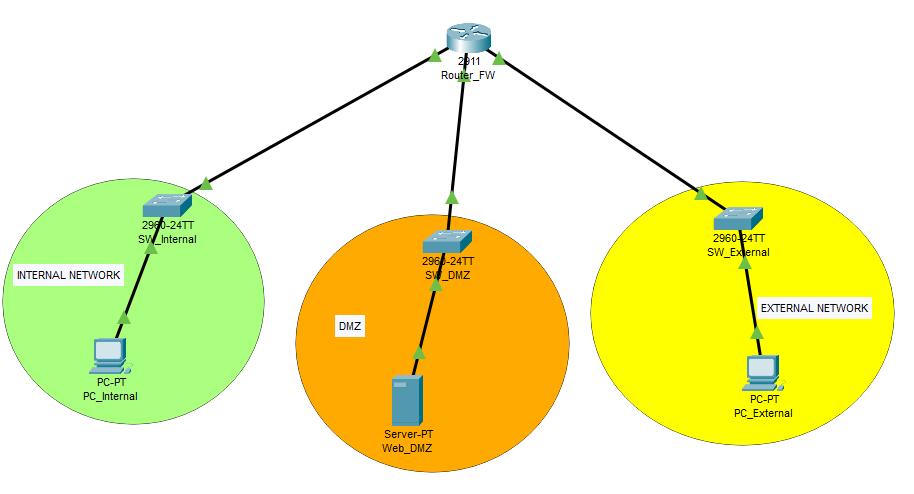
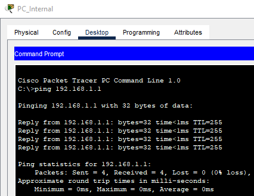
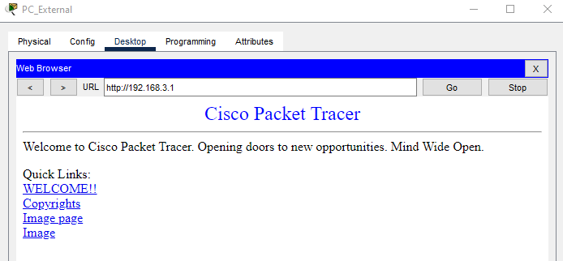
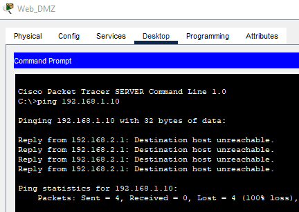
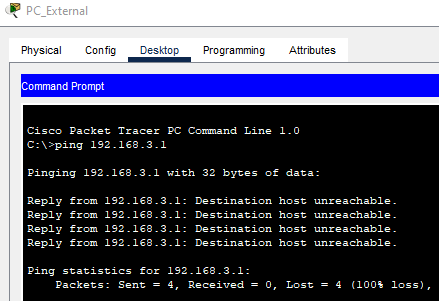
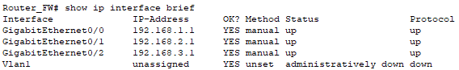
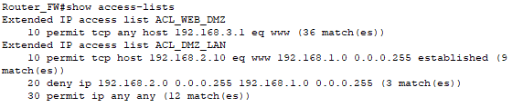
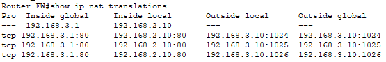

# Informe de configuración de DMZ con Cisco Packet Tracer


### 1. Objetivo del laboratorio

Configurar una DMZ segura en Cisco Packet Tracer separando LAN, DMZ y red externa, publicando un servidor web mediante NAT estático y restringiendo el tráfico entre zonas con ACLs.


---

### 2. Topología implementada

A continuación se muestra una imagen de la topología de la red:



- **Cantidad de redes:** 3 (LAN, DMZ, Externa)
- **Dispositivos usados:**
	- 1 router Cisco ISR 2911 (Router_FW)
	- 3 switches Cisco 2960 (SW_Internal, SW_DMZ, SW_External)
	- 2 PCs (PC_Internal, PC_External)
	- 1 servidor (Web_DMZ)

A continuación se detalla la función de cada zona de la red:

- **LAN:** red interna de usuarios (PC_Internal)
- **DMZ:** red aislada para servicios expuestos (Server Web_DMZ)
- **Externa:** red simulando Internet (PC_External)


### 3. Plan de direccionamiento IP


| Dispositivo             | IP               | Máscara          | Gateway           |
|-------------------------|------------------|-------------------|-------------------|
| PC_Internal             |192.168.1.10      |255.255.255.0      |192.168.1.1        |
| Server_DMZ              |192.168.2.10      |255.255.255.0      |192.168.2.1        |
| PC_External             |192.168.3.10      |255.255.255.0      |192.168.3.1        |
| Router_FW Gi0/0 (LAN)   |192.168.1.1       |255.255.255.0      |-                  |
| Router_FW Gi0/1 (DMZ)   |192.168.2.1       |255.255.255.0      |-                  |
| Router_FW Gi0/2 (Ext)   |192.168.3.1       |255.255.255.0      |-                  |


### 4. Configuración aplicada (resumen)

Una vez configurados los equipos con los parámetros de la anterior tabla, configuramos las interfaces del Router_FW:

- GigabitEthernet0/0; usamos el comando "ip address 192.168.1.1 255.255.255.0" y "no shutdown" para que no se desactive la interfaz.
- GigabitEthernet0/1; usamos el comando "ip address 192.168.2.1 255.255.255.0" y "no shutdown" para que no se desactive la interfaz.
- GigabitEthernet0/2; usamos el comando "ip address 192.168.3.1 255.255.255.0" y "no shutdown" para que no se desactive la interfaz.

Seguidamente configuramos el NAT estático en el Router_FW:

- GigabitEthernet0/1; usamos el comando "ip nat inside" para indicar que la interfaz DMZ es 'inside' para el NAT.
- GigabitEthernet0/2; usamos el comando "ip nat outside" para indicar que la interfaz externa es 'outside' para el NAT.

Finalmente aplicamos el comando del NAT estático;
```bash
ip nat inside source static 192.168.2.10 192.168.3.1
```

Acto seguido ejecutamos un "write memory" para guardar los cambios en la configuración del router.

Más adelante configuramos las ACLs:

- ACL_WEB_DMZ
Creamos la ACL;
```bash
ip access-list extended ACL_WEB_DMZ
permit tcp any host 192.168.3.1 eq 80
exit
```
La asignamos a la interfaz correspondiente;
```bash
interface GigabitEthernet0/2
ip access-group ACL_WEB_DMZ in
exit
```
- ACL_DMZ_LAN
Creamos la ACL;
```bash
ip access-list extended ACL_DMZ_LAN
permit tcp host 192.168.2.10 eq www 192.168.1.0 0.0.0.255 established
deny ip 192.168.2.0 0.0.0.255 192.168.1.0 0.0.0.255
permit ip any any
exit
```
La asignamos a la interfaz correspondiente;
```bash
interface GigabitEthernet0/1
ip access-group ACL_DMZ_LAN in
exit
```


### 5. Verificaciones realizadas

Se han realizado las siguientes verificaciones:

- `ping` desde PC_Internal al router:


- acceso web desde PC_External:


- bloqueo de acceso desde DMZ a LAN:


- bloqueo ICMP desde PC_External a WAN/IP pública del servidor:



### 6. Conclusiones y recomendaciones

Este laboratorio me permitió aplicar principios básicos de segmentación de red y defensa perimetral:

- La DMZ reduce el impacto de compromisos al aislar servicios expuestos.  

- Las ACLs permiten una política de “permitir solo lo necesario” (mínimo privilegio).

- El NAT estático publica el servicio sin exponer la IP privada real del servidor.

Recomendaciones:

- Documentar siempre el plan de direccionamiento y el orden de aplicación de ACL/NAT.

- Probar conectividad antes de endurecer reglas.


### 7. Capturas de evidencia

- ver configuración interfaces
 

- ver access-lists


- ver NAT translations
